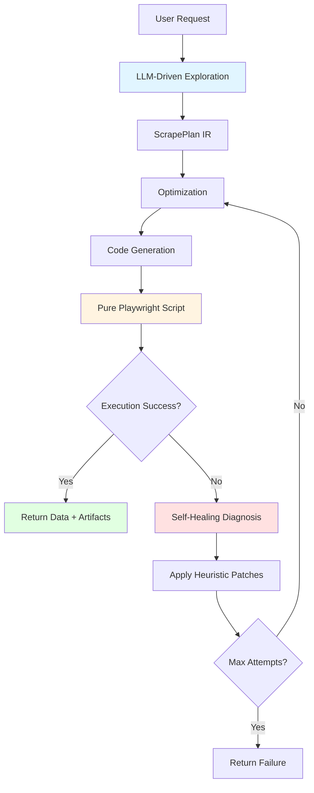

**IMPORTANT: ** This project is published as open source under the MIT license.
We do **not**, however, currently provide any support, including the possibility to file
issues. We are open to accepting pull requests that fix bugs or add useful functionality,
though.

# Scry - Agentic Web Scraper

**Scry** (from "scrying" - the practice of seeing hidden information) is an intelligent web scraper with LLM-driven exploration and self-healing capabilities.

## Features

- **Agentic Exploration**: LLM-driven navigation using Anthropic Claude + Playwright
- **Complete Action Vocabulary**: Navigate, Click, Fill, Select (dropdowns), Hover (hover effects), KeyPress (keyboard events), Upload (file uploads), WaitFor, Validate
- **LLM-Driven Authentication**: Automatic login form detection and filling using credentials from `login_params`
- **Self-Healing**: Automatic retry with intelligent patches on failure (up to 20 repair attempts)
- **IR-Based Architecture**: Exploration → ScrapePlan IR → Optimization → Code generation → Execution
- **No AI at Runtime**: Generated scripts are pure Playwright Python with no embedded secrets
- **Event-Driven**: Redis-based async job processing

## Quick Start

### Local Installation

```bash
# Install package
pip install -e .

# Install Playwright browsers
python -m playwright install chromium

# Start API server
uvicorn scry.app:create_app --factory --host 0.0.0.0 --port 8000

# Health check
curl http://localhost:8000/healthz
```

### Basic Usage

```bash
curl -X POST http://localhost:8000/scrape \
  -H 'Content-Type: application/json' \
  -d '{
    "nl_request": "Extract product information",
    "output_schema": {
      "type": "object",
      "properties": {
        "title": {"type": "string"},
        "price": {"type": "number"},
        "description": {"type": "string"}
      }
    },
    "target_urls": ["https://example-shop.com/product"]
  }'
```

### With Authentication

```bash
curl -X POST http://localhost:8000/scrape \
  -H 'Content-Type: application/json' \
  -d '{
    "nl_request": "Extract my recent orders",
    "output_schema": {
      "type": "object",
      "properties": {
        "orders": {"type": "array", "items": {"type": "string"}}
      }
    },
    "target_urls": ["https://example-shop.com"],
    "login_params": {
      "username": "user@example.com",
      "password": "secret123"
    }
  }'
```

The LLM will automatically:
1. Detect login forms by analyzing page elements
2. Fill credentials using the provided username/password
3. Submit the form
4. Proceed with the main task after authentication

## MCP Server

Scry can be run as an [MCP (Model Context Protocol)](https://modelcontextprotocol.io/) server, allowing LLM agents to use browser automation as a tool.

### Starting the MCP Server

```bash
# Start MCP server (default port 8085)
python -m scry.mcp_server

# Or with custom configuration
MCP_PORT=8085 MCP_HOST=0.0.0.0 python -m scry.mcp_server
```

### The `browser` Tool

The MCP server exposes a single powerful tool called `browser`:

```json
{
  "name": "browser",
  "description": "Automate browser tasks using LLM-driven exploration and code generation",
  "parameters": {
    "url": "The starting URL to navigate to",
    "task": "Natural language description of what to accomplish",
    "output_schema": "JSON schema describing expected output data structure",
    "login_username": "Optional username for form-based login",
    "login_password": "Optional password for form-based login",
    "max_steps": "Maximum exploration steps (default 20)"
  }
}
```

**Example tool call:**
```json
{
  "url": "https://news.ycombinator.com",
  "task": "Extract the top 5 story titles from the front page",
  "output_schema": {
    "type": "object",
    "properties": {
      "titles": {
        "type": "array",
        "items": {"type": "string"},
        "description": "List of story titles"
      }
    }
  }
}
```

**Response:**
```json
{
  "job_id": "abc123",
  "data": {
    "titles": ["Story 1", "Story 2", "Story 3", "Story 4", "Story 5"]
  },
  "execution_log": ["received", "exploring", "exploration_complete", "codegen", "executing_script", "done"],
  "status": "success",
  "last_screenshot_b64": "iVBORw0KGgo..."
}
```

### MCP Client Integration

**Python (using langchain-mcp-adapters):**
```python
from langchain_mcp_adapters.client import MultiServerMCPClient

client = MultiServerMCPClient({
    "scry": {
        "url": "http://localhost:8085/mcp",
        "transport": "streamable_http",
    }
})

tools = await client.get_tools()
# tools now contains the 'browser' tool
```

**Using with Claude Desktop or other MCP hosts:**
```json
{
  "mcpServers": {
    "scry": {
      "url": "http://localhost:8085/mcp",
      "transport": "streamable-http"
    }
  }
}
```

## Async Browser Pool

Scry includes an async browser pool that eliminates cold-start latency by pre-launching browsers.

### Performance

| Metric | Without Pool | With Pool |
|--------|-------------|-----------|
| First request | 3-5s | 0.3s (pool init) + 0.05s (acquire) |
| Subsequent requests | 3-5s | ~0.05s |

### Configuration

```bash
# Enable/disable pool (default: true)
BROWSER_USE_POOL=true

# Number of pre-launched browsers (default: 2)
BROWSER_POOL_SIZE=2

# Recycle browser after N requests (default: 100)
BROWSER_MAX_REQUESTS=100

# Recycle browser after N seconds (default: 3600)
BROWSER_MAX_AGE=3600

# Health check interval in seconds (default: 60)
BROWSER_HEALTH_CHECK_INTERVAL=60
```

### How It Works

1. On first request, the pool initializes N browsers asynchronously (~0.3s)
2. Requests acquire a browser from the pool (~0.05s vs 3-5s cold start)
3. After use, browsers return to the pool for reuse
4. Unhealthy browsers are automatically replaced
5. Browsers are recycled after max requests or max age to prevent memory leaks

## Docker Compose Setup

```bash
cd docker/compose
docker compose up --build
```

This starts:
- `redis` - Job queue
- `api` - FastAPI server
- `worker` - Async job processor

Create a `.env` file in `docker/compose/` with:
```
ANTHROPIC_API_KEY=your_key_here
```

## Environment Variables

**Required:**
- `ANTHROPIC_API_KEY` or `CLAUDE_API_KEY`

**Optional - General:**
- `NAV_BACKEND`: `playwright` (native agentic exploration, default)
- `HEADLESS`: `true` (default)
- `EVENT_BACKEND`: `redis` (for Docker) or `inmemory` (local)
- `REDIS_URL`: `redis://redis:6379/0`
- `ARTIFACTS_ROOT`: `/app/artifacts`
- `MAX_EXPLORATION_STEPS`: Max exploration steps (default 20)
- `MAX_REPAIR_ATTEMPTS`: Self-healing retry limit (default 20)

**Optional - MCP Server:**
- `MCP_PORT`: Port for MCP server (default 8085)
- `MCP_HOST`: Host to bind MCP server (default 0.0.0.0)

**Optional - Browser Pool:**
- `BROWSER_USE_POOL`: Enable browser pool (default true)
- `BROWSER_POOL_SIZE`: Number of pre-launched browsers (default 2)
- `BROWSER_MAX_REQUESTS`: Recycle after N requests (default 100)
- `BROWSER_MAX_AGE`: Recycle after N seconds (default 3600)
- `BROWSER_HEALTH_CHECK_INTERVAL`: Health check interval in seconds (default 60)

## Artifacts

Generated artifacts are stored in `artifacts/`:
- **Screenshots**: `screenshots/{job_id}/step-*.png` - Step-by-step screenshots
- **Generated Code**: `generated_code/{job_id}.py` - Pure Playwright Python scripts
- **HTML Snapshots**: `html/{job_id}-page-*.html` - HTML snapshots for diagnosis

## Testing

```bash
# Run all tests
pytest tests/ -v

# Run only unit tests
pytest tests/ -v -m "not integration"

# Run integration tests (requires ANTHROPIC_API_KEY)
pytest tests/ -v -m integration

# Run specific test suites
pytest tests/test_data_extraction.py -v
pytest tests/test_api_routes.py -v
pytest tests/test_new_actions.py -v
```

## Architecture

See [CLAUDE.md](CLAUDE.md) for detailed architecture documentation.

### System Flow



**Key Phases:**

1. **LLM-Driven Exploration** (adapters/playwright_explorer.py)
   - Claude analyzes page state and decides actions
   - Captures screenshots, HTML, URLs at each step
   - Outputs: ExplorationResult with navigation steps

2. **IR Compression** (core/ir/model.py)
   - Converts exploration into ScrapePlan IR
   - Actions: Navigate, Click, Fill, Select, Hover, KeyPress, Upload, WaitFor, Validate

3. **Optimization** (core/optimizer/optimize.py)
   - Compresses redundant paths
   - Stabilizes selectors with fallbacks

4. **Code Generation** (core/codegen/generator.py)
   - Generates pure Playwright Python script
   - No AI dependencies at runtime
   - No embedded secrets

5. **Execution** (core/executor/runner.py)
   - Runs generated script in isolated subprocess
   - Captures artifacts (screenshots, HTML)
   - Returns structured data

6. **Self-Healing** (core/self_heal/)
   - On failure: diagnose with HTML snapshots
   - Apply heuristic patches: wait_load_state, extra_wait_ms, handle_cookie_banner, etc.
   - Regenerate and retry (up to 20 attempts)

**Key Components:**
- `src/scry/api/` - REST endpoints
- `src/scry/core/` - Core business logic (IR, nav, extraction, optimization, codegen, execution, validation, self-healing)
- `src/scry/adapters/` - External integrations (Playwright, Anthropic Claude)
- `src/scry/runtime/` - Event bus and storage
- `src/scry/worker.py` - Async job processor

# License

You are free to use this project under the permissions of the [MIT License](./LICENSE.md).