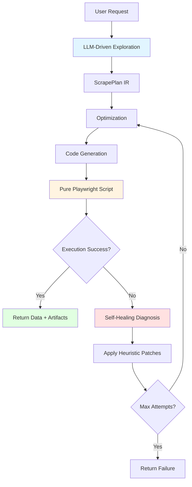

# Architecture Overview

Scry is a universal web scraper that implements agentic exploration with self-healing capabilities.

## Core Principles

- **Agentic exploration** using native Playwright + Anthropic Claude LLM for intelligent navigation
- **IR compression** to create deterministic Playwright scripts (ScrapePlan with Navigate, Click, Fill, WaitFor, Validate steps)
- **Self-healing loop** with up to 20 repair attempts using heuristic patches
- **Event-driven architecture** with Redis for async job processing
- **No AI at runtime** - generated scripts are pure Playwright Python

## System Flow

## Key Design Decisions

### No AI at Runtime

Generated Playwright scripts contain no AI dependencies or embedded secrets. This means:

- Scripts can be run independently
- No API costs during script execution
- Reproducible behavior
- Easy debugging

### Self-Healing

When execution fails, the system:

1. Diagnoses the failure using HTML snapshots
2. Proposes heuristic patches (e.g., `wait_load_state`, `extra_wait_ms`, `handle_cookie_banner`)
3. Regenerates the script with patches applied
4. Retries execution (up to 20 attempts)

### IR-Based Architecture

The intermediate representation (ScrapePlan IR) decouples exploration from execution:

- Exploration produces structured action steps
- Optimization compresses and stabilizes selectors
- Code generation produces executable scripts
- Execution runs scripts in isolation

## Next Steps

- [Data Flow](data-flow.md) - Detailed phase breakdown
- [Module Structure](modules.md) - Code organization
