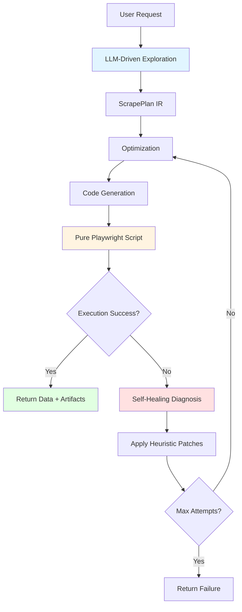

# Scry - Agentic Web Scraper

**Scry** (from "scrying" - the practice of seeing hidden information) is an intelligent web scraper with LLM-driven exploration and self-healing capabilities.

## Features

- **Agentic Exploration**: LLM-driven navigation using Anthropic Claude + Playwright
- **Complete Action Vocabulary**: Navigate, Click, Fill, Select (dropdowns), Hover (hover effects), KeyPress (keyboard events), Upload (file uploads), WaitFor, Validate
- **LLM-Driven Authentication**: Automatic login form detection and filling using credentials from `login_params`
- **Self-Healing**: Automatic retry with intelligent patches on failure (up to 20 repair attempts)
- **IR-Based Architecture**: Exploration → ScrapePlan IR → Optimization → Code generation → Execution
- **No AI at Runtime**: Generated scripts are pure Playwright Python with no embedded secrets
- **Event-Driven**: Redis-based async job processing

## How It Works

## Quick Links

- [Installation](getting-started/installation.md) - Get started with Scry
- [Quick Start](getting-started/quick-start.md) - Run your first scrape
- [API Endpoints](api/endpoints.md) - REST API reference
- [Architecture Overview](architecture/overview.md) - Understand the system design

## License

This project is published as open source under the MIT license. We do not currently provide support, including the possibility to file issues. We are open to accepting pull requests that fix bugs or add useful functionality.
